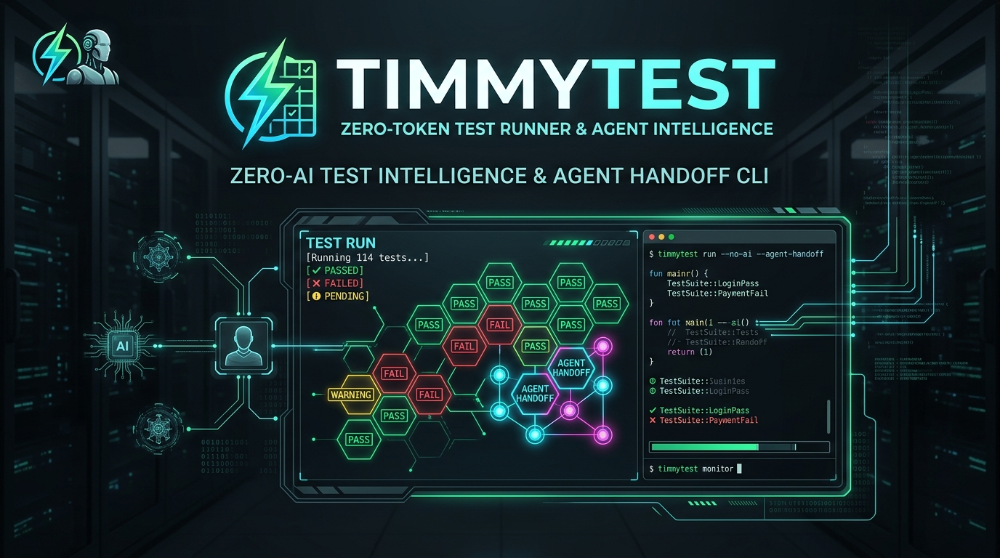

<div align="center">



# ⚡ TimmyTest

### Zero-Token Test Runner • AST Test Gap Detector • AI Agent Prompt Generator

[](https://pypi.org/project/timmytest/)
[](https://www.python.org/)
[](LICENSE)
[](tests/)
[](https://github.com/astral-sh/ruff)
[](#-why-timmytest-the-token-drain-problem)

**Stop burning tens of thousands of LLM tokens on test exploration.**  
TimmyTest analyzes any codebase, executes tests locally with 0 AI tokens, detects missing test modules, isolates failure root causes with actionable suggestions, and produces an ultra-dense, copy-pasteable handoff prompt for AI coding agents.

[Türkçe Dokümantasyon](README.tr.md) &nbsp;·&nbsp; [Quick Start](#-quick-start) • [Installation](#-installation) • [Core Features](#-features) • [Ecosystems](#-supported-ecosystems) • [Command Reference](#-command-reference) • [Token Savings](#-why-timmytest-the-token-drain-problem)

---

</div>

## 💡 Why TimmyTest? The Token-Drain Problem

When AI coding agents (Claude Code, OpenAI Codex, Antigravity, Cursor, Copilot, Gemini CLI) are tasked with testing or fixing software, they typically:
1. Burn **15,000–35,000 tokens** running directory listings and probing for test configurations.
2. Guess test runner commands, trigger environment errors, and re-read entire test logs.
3. Waste context window length on raw stdout / tracebacks rather than actual bug fixing.

### 💰 Token Cost & Efficiency Comparison

| Feature / Phase | Standard AI Agent Alone | With TimmyTest Local Pre-flight |
| :--- | :--- | :--- |
| **Project & Stack Discovery** | 💸 8,000–15,000 tokens | ⚡ **0 tokens** (Local AST + Config detector) |
| **Finding Missing Test Modules**| 💸 10,000–25,000 tokens | ⚡ **0 tokens** (Deterministic Gap Analyzer) |
| **Test Execution & Parsing** | 💸 12,000–30,000 tokens | ⚡ **0 tokens** (Subprocess runner & regex parser) |
| **Traceback & Error Isolation**| 💸 5,000–18,000 tokens | ⚡ **0 tokens** (Rule-based diagnostic engine) |
| **AI Agent Consumption** | ❌ **35,000–88,000+ tokens** | ✅ **~400–900 tokens** (Direct Handoff Prompt) |
| **Speed & Accuracy** | ⚠️ Slow, hallucination-prone | 🚀 **Instant, 100% Deterministic** |

---

## 🚀 Installation

### Using `uv` (Recommended - Ultra Fast)
```bash
uv tool install timmytest
```

### Using `pipx` or `pip`
```bash
pipx install timmytest
# or
pip install timmytest
```

---

## ⚡ Quick Start

### 1. Complete Project Audit (Scan + Run + Gap Analysis + AI Prompt)
Run a full audit on your current directory or any project path:
```bash
timmytest check .
```
> 💡 *Automatically copies the dense AI prompt directly to your clipboard!*

### 2. Fast Static Gap Scan (No Test Execution)
Discover all source modules, existing test files, and missing test modules:
```bash
timmytest scan /path/to/project
```

### 3. Diagnose & Fix Suggestions
Run test suite and display rich failure analysis with suggestions:
```bash
timmytest run --only-failures
```

### 4. Generate AI Agent Handoff Prompt
Output the optimized prompt for Claude Code, Cursor, Codex, or Antigravity:
```bash
timmytest prompt --copy
```

---

## 🏗️ Architecture & How It Works

```
┌──────────────────────────────────────────────────────────────────────────┐
│                             TIMMYTEST ENGINE                             │
│       Zero-AI Local Intelligence • Deterministic Diagnostics             │
└──────────────────────────────────────────────────────────────────────────┘
                                     │
           ┌─────────────────────────┼─────────────────────────┐
           ▼                         ▼                         ▼
┌───────────────────────┐ ┌───────────────────────┐ ┌──────────────────────┐
│  Ecosystem Detector   │ │     Runner Engine     │ │ Diagnostics & Gaps   │
├───────────────────────┤ ├───────────────────────┤ ├──────────────────────┤
│ • Python (pytest/unit)│ │ • Subprocess Sandbox  │ │ • AST Source Mapper  │
│ • Node/TS (vitest/jest│ │ • Auto Executable Res │ │ • Uncovered Modules  │
│ • Rust (cargo test)   │ │ • Timeout Management  │ │ • Root-Cause Classifier│
│ • Go (go test)        │ │ • Output Normalization│ │ • Fix Suggester      │
└───────────────────────┘ └───────────────────────┘ └──────────────────────┘
                                     │
                                     ▼
┌──────────────────────────────────────────────────────────────────────────┐
│                   AI AGENT HANDOFF PROMPT GENERATOR                      │
│   Token-dense, structured Markdown card • Auto-copied to OS Clipboard   │
└──────────────────────────────────────────────────────────────────────────┘
```

---

## 📦 Supported Ecosystems & Frameworks

| Language / Platform | Detected Configurations | Supported Test Runners |
| :--- | :--- | :--- |
| **Python** | `pyproject.toml`, `setup.py`, `pytest.ini`, `requirements.txt` | `pytest`, `unittest` |
| **TypeScript / JS** | `package.json`, `tsconfig.json`, `vitest.config.ts`, `jest.config.js` | `vitest`, `jest`, `mocha`, `playwright`, `npm test` |
| **Rust** | `Cargo.toml` | `cargo test` |
| **Go** | `go.mod`, `*_test.go` | `go test ./...` |
| **Generic / Custom** | Any CLI repository | User-defined test command (`--cmd`) |

---

## 📖 Command Reference

### `timmytest check`
Performs a comprehensive audit: discovers ecosystem, runs tests, detects gaps, categorizes failures, and generates the AI prompt.

```bash
timmytest check [PROJECT_DIR] [OPTIONS]

Options:
  -c, --copy-prompt / -nc, --no-copy-prompt  Copy prompt to clipboard [default: True]
  -sp, --save-prompt PATH                    Save prompt to Markdown file
  -sr, --save-report PATH                    Save full audit report to Markdown
  -j, --json                                 Output results in JSON format
  -t, --timeout INTEGER                      Test timeout in seconds [default: 60]
  -k, --filter TEXT                          Filter test names (e.g. -k "auth")
  --cmd TEXT                                 Custom test command override
  --no-run                                   Skip test execution (scan only)
  --no-banner                                Omit ASCII header
```

### `timmytest scan`
Performs static code inspection and gap analysis without executing tests.
```bash
timmytest scan . --json
```

### `timmytest run`
Executes tests, isolates failures, and provides rule-based code suggestions.
```bash
timmytest run . --only-failures --timeout 120
```

### `timmytest prompt`
Outputs or copies the dense AI prompt card.
```bash
timmytest prompt . --raw --no-copy > agent-prompt.md
```

### `timmytest init`
Initializes starter test scaffolding (`tests/` directory, configuration, and sanity tests) if the project lacks test files.
```bash
timmytest init .
```

---

## 🤖 Example AI Agent Handoff Prompt

When TimmyTest detects issues or missing tests, it outputs a dense handoff card:

```markdown
### ⚡ TimmyTest Diagnostic Handoff for AI Agent
**Project**: `PaymentGateway` (Python / pytest)
**Test Results**: 14 Passed, 1 Failed, 0 Skipped (93.3% Pass Rate) | Test Readiness Score: 68.4%
**Test Runner Command**: `pytest -ra`

#### ❌ Failing Tests (1)
1. **Test**: `tests/test_stripe.py::test_webhook_signature_verification` (`tests/test_stripe.py:54`)
   - **Error Type**: `AssertionError`
   - **Message**: assert 400 == 401
   - **Suggested Fix**: Value mismatch: Expected '401', got '400'. Adjust implementation return value or update test assertion.
   - **Traceback Snippet**:
     ```
     tests/test_stripe.py:54: in test_webhook_signature_verification
         assert response.status_code == 401
     E   AssertionError: assert 400 == 401
     ```

#### ⚠️ Missing Test Modules & Gaps (2)
1. **[HIGH]** Source: `src/services/refunds.py` -> Expected Test: `tests/test_refunds.py` (Classes: RefundProcessor; Functions: issue_refund, calculate_fees)
   - Reason: Classes without unit tests: RefundProcessor | Functions without test coverage: issue_refund, calculate_fees
2. **[MEDIUM]** Source: `src/utils/idempotency.py` -> Expected Test: `tests/test_idempotency.py` (Functions: get_idempotency_key)
   - Reason: Functions without test coverage: get_idempotency_key

#### 🎯 Instructions & Next Steps for AI Agent
1. **Fix Failing Tests**: Investigate and resolve the 1 test failure(s) listed above.
2. **Write Missing High-Priority Tests**: Create unit/integration test files for the 1 high-priority module(s) (`tests/test_refunds.py`).
3. **Verify**: Run `pytest -ra` locally to ensure all tests pass cleanly without errors.
```

---

## 🧪 CI/CD Integration

### GitHub Actions Workflow Example
Add `.github/workflows/timmytest.yml`:

```yaml
name: TimmyTest Code Readiness Audit

on: [push, pull_request]

jobs:
  audit:
    runs-on: ubuntu-latest
    steps:
      - uses: actions/checkout@v4
      - uses: actions/setup-python@v5
        with:
          python-version: "3.12"
      - name: Install TimmyTest
        run: pip install timmytest
      - name: Run TimmyTest Audit
        run: timmytest check . --no-banner --save-report audit-report.md
      - name: Upload Audit Artifact
        uses: actions/upload-artifact@v4
        with:
          name: timmytest-report
          path: audit-report.md
```

---

## 🤝 Contributing

Contributions are warmly welcomed! Please check out [CONTRIBUTING.md](CONTRIBUTING.md) and [CODE_OF_CONDUCT.md](CODE_OF_CONDUCT.md) for details on our development workflow, submitting pull requests, and coding standards.

```bash
# Clone the repository
git clone https://github.com/tugrakaymakcioglu/TimmyTest.git
cd TimmyTest

# Install with uv in editable mode
uv venv
source .venv/bin/activate  # Or .\.venv\Scripts\activate on Windows
uv pip install -e .[dev]

# Run tests & linter
pytest -v
ruff check .
mypy src
```

---

## 📄 License

TimmyTest is open-source software licensed under the **[Apache License 2.0](LICENSE)**.

---

<div align="center">

**Built with ❤️ for developers and AI coding agents.**  
*Star ⭐ this repository if TimmyTest saved your tokens!*

</div>
