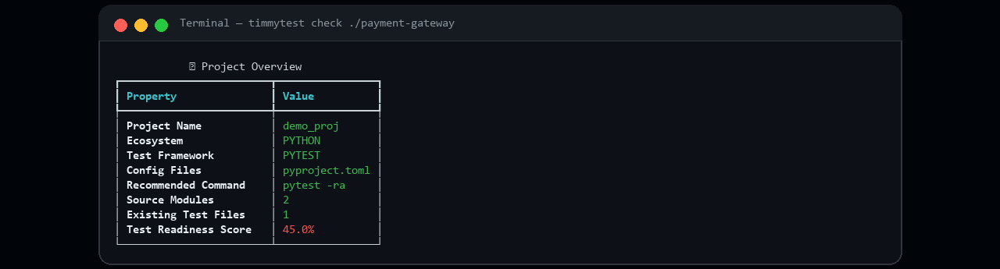
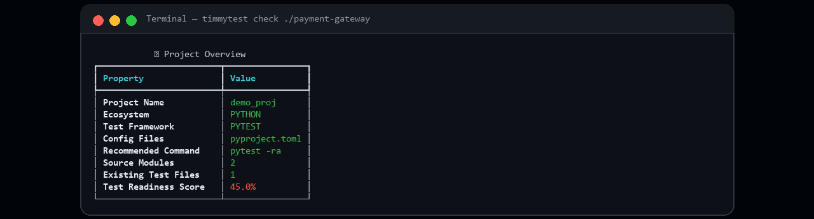
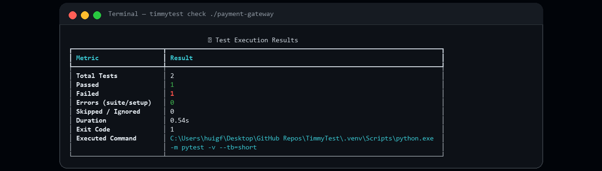
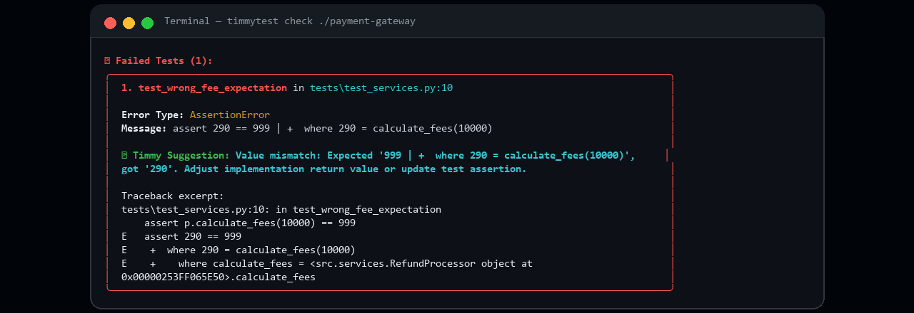
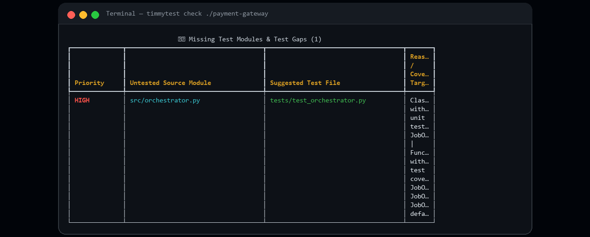
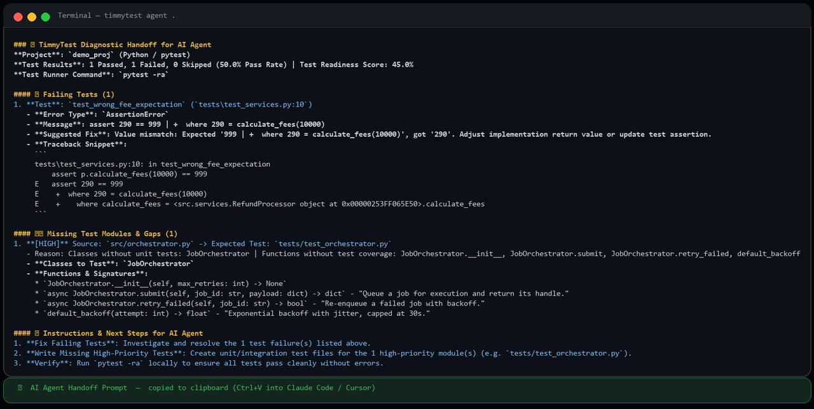

<div align="center">


# ⚡ TimmyTest

### Sıfır-Token Test Koşucusu • AST Test Açığı Analizörü • AI Ajan Prompt Üreticisi • MCP Sunucusu

[English](README.md) · **Türkçe** · [中文](README.zh-CN.md)

[](https://github.com/tugrakaymakcioglu/TimmyTest)
[](https://www.python.org/)
[](https://github.com/tugrakaymakcioglu/TimmyTest/actions/workflows/ci.yml)
[](tests/)
[](LICENSE)
[](#-model-context-protocol-mcp-sunucusu)

**Test keşfi için oturum başına 15–80 bin token yakmayı bırakın.**
TimmyTest testlerinizi **0 AI token'ı ile** yerelde çalıştırır, her kaynak modülü testleriyle
deterministik AST analiziyle eşler, hata kök nedenlerini kural tabanlı çözümlerle izole eder ve
AI kodlama ajanınıza 2 saniyeden kısa sürede yoğun, kopyala-yapıştır teşhis prompt'u verir.

[🚀 Hızlı Başlangıç](#-hızlı-başlangıç) · [🎬 Demo](#-canlı-demo) · [🔌 MCP Sunucusu](#-model-context-protocol-mcp-sunucusu) · [📦 Kurulum](#-kurulum) · [💰 Token Tasarrufu](#-neden-timmytest-token-tükenme-problemi)

</div>

---

## 🎬 Canlı Demo

Gerçek terminal çıktısı — 1 başarısız test ve 1 testsiz modül içeren demo Python projesinde `timmytest check`:



<details>
<summary><b>📸 Tam çözünürlüklü kareler</b></summary>

| Adım | Ekran Görüntüsü |
|:---|:---|
| **Proje özeti** — ekosistem, framework, hazırlık skoru milisaniyeler içinde |  |
| **Test yürütme** — 2 test yerelde koştu: 1 geçti, 1 kaldı, çıkış kodu raporlandı |  |
| **Hata teşhisi** — kök neden, beklenen vs gerçek ve kural tabanlı çözüm önerisi |  |
| **Açık analizi** — `src/orchestrator.py`'ın test dosyası yok; HIGH öncelik, tam yol önerilir |  |
| **Ajan elçisi** — AI'ınızın aldığı yoğun prompt (panoya otomatik kopyalanır) |  |

</details>

---

## 💡 Neden TimmyTest? Token Tükenme Problemi

AI kodlama ajanları (Claude Code, OpenAI Codex, Antigravity, Cursor, Copilot, Gemini CLI) test yazmak veya hata düzeltmek için görevlendirildiğinde tipik olarak:

1. Dizin listeleme ve test yapılandırması aramak için **15.000–35.000 token** harcar.
2. Test koşucu komutlarını tahmin eder, ortam hataları alır ve tüm test günlüklerini yeniden okur.
3. Bağlam penceresini gerçek hatayı düzeltmek yerine ham çıktıyla doldurur.

### 💰 Token Maliyeti ve Verimlilik Karşılaştırması

| Aşama | Tek Başına AI Ajanı | TimmyTest Ön Kontrolüyle |
| :--- | :--- | :--- |
| Proje ve yığın keşfi | 💸 8.000–15.000 token | ⚡ **0 token** (yerel AST + config dedektörü) |
| Eksik test modüllerini bulma | 💸 10.000–25.000 token | ⚡ **0 token** (deterministik açık analizi) |
| Test yürütme ve ayrıştırma | 💸 12.000–30.000 token | ⚡ **0 token** (alt süreç koşucu + ayrıştırıcılar) |
| Traceback ve hata izolasyonu | 💸 5.000–18.000 token | ⚡ **0 token** (kural tabanlı teşhis) |
| **Ajan tüketimi** | ❌ **35.000–88.000+ token** | ✅ **~400–900 token** (yoğun elçi prompt'u) |
| Hız ve doğruluk | ⚠️ Yavaş, halüsinasyona açık | 🚀 Anında, %100 deterministik |

> **Net etki:** test düzeltme oturumu başına **~%98 daha az token** ve ajan tahmin yerine doğrulanmış bir teşhisle başlar.

---

## 🚀 Hızlı Başlangıç

### 0. Tam Ekran Uygulama
```bash
timmytest
```
Pixel-art açılış → sistem kontrolleri → dil seçimi (**Türkçe / English**) → çalışma alanı sihirbazı →
geçti/kaldı/açık grafikleri ve **ÇALIŞTIR** düğmesi olan canlı gösterge paneli. `timmytest ui --fresh`
kurulumu baştan oynatır; borulu/CI çağrıları klasik komut listesini gösterir (`--classic`).

### 1. Tek komutla AI kurulumu
```bash
timmytest integrate
```
Mevcut repoda `.cursorrules`, `CLAUDE.md`, `AGENTS.md`, `.github/copilot-instructions.md`,
`.timmytest.yml` ve `.cursor/mcp.json` üretir — ajanlarınız sıfır-token testi otomatik izler.

### 2. Tam denetim (tarama + koşu + açıklar + AI prompt)
```bash
timmytest check .
```
> 💡 *Yoğun AI prompt'unu otomatik olarak panonuza kopyalar.*

### 3. Sıfır gürültülü ajan çıktısı
```bash
timmytest agent .          # AI ajanları için yoğun markdown
timmytest agent . --json   # makine okunur JSON
```

### 4. Statik açık taraması (yürütme yok)
```bash
timmytest scan /proje/yolu
```

### 5. Teşhisli test koşusu
```bash
timmytest run --only-failures --timeout 120
```

---

## 📦 Kurulum

```bash
# uv (en hızlı)
uv tool install timmytest

# pipx
pipx install timmytest

# pip
pip install timmytest

# kurulum olmadan
uvx timmytest check
```

---

## 📖 Desteklenen Ekosistemler

TimmyTest, **35+ ekosistemlik veri güdümlü bir kayıt defteri**yle gelir (gerçek GitHub depolarından
öğrenilen katman dahil):

| Dil | Test Koşucuları | | Dil | Test Koşucuları |
| :--- | :--- | --- | :--- | :--- |
| **Python** | pytest, unittest | | **PHP** | phpunit |
| **JS/TS** | vitest, jest, mocha, playwright, node --test | | **Ruby** | rspec, minitest |
| **Rust** | cargo test | | **Swift** | xctest |
| **Go** | go test | | **Elixir** | exunit |
| **Java** | junit (maven/gradle) | | **Haskell** | hspec |
| **Kotlin** | kotlintest, gradle | | **C/C++** | ctest, gtest |
| **C#/.NET** | dotnet test | | **Lua** | busted |
| **Dart/Flutter** | dart test | | **Perl** | prove |
| **Solidity** | forge, hardhat | | **…ve 20+ dil** | |

<details>
<summary><b>İçinde paketli akıllı davranışlar</b></summary>

- **Artımlı koşular**: `--changed` yalnızca commitlenmemiş değişikliklerden etkilenen testleri çalıştırır; `--since main` dal kapsamlar.
- **Kapsam duyarlı**: `--coverage` `coverage.json` / `cobertura.xml` / `lcov.info` ayrıştırır, düşük kapsamlı dosyaları açık olarak işaretler.
- **İzleme modu**: `--watch` dosya değişiminde denetimi yeniler (budanmış gezinme — `node_modules` fırtınası yok).
- **CI çıkış kodları**: süit düzeyi hatalar (yüklenemeyen test dosyaları) CI'ı düşürür, sadece assertion hataları değil.
- **Varsayılan olarak güvenli**: shell yok, `stdin=DEVNULL`, zaman aşımında süreç-ağacı sonlandırma, ReDoS-güvenli tarayıcılar.
- **Kendi kendine öğrenen kayıt defteri**: `TimmyTestTestDev` GitHub konvansiyonlarını madenciler ve algılamayı genişletir.

</details>

---

## 🔌 Model Context Protocol (MCP) Sunucusu

MCP uyumlu her istemci (Claude Desktop, Claude Code, Cursor, Antigravity, Windsurf, Zed) TimmyTest'i yerel araç olarak çağırabilir:

| Araç | Açıklama |
| :--- | :--- |
| `timmytest_check` | Tam sıfır-token denetim: testleri koş, açıklar, teşhisler, AI prompt'u. |
| `timmytest_scan` | Statik AST taraması: testsiz fonksiyonlar, sınıflar, eksik test dosyaları. |
| `timmytest_run` | Testleri çalıştır, çözüm önerili izole hataları döndür. |
| `timmytest_prompt` | Yoğun, token-optimize düzeltme/test-yazma prompt'u üret. |
| `timmytest_integrate` | Ajan kurallarını ve yapılandırmaları projeye kur. |

```json
{
  "mcpServers": {
    "timmytest": { "command": "timmytest", "args": ["mcp"] }
  }
}
```

---

## 🧪 CI/CD Entegrasyonu

```yaml
# .github/workflows/timmytest.yml
name: TimmyTest Denetimi
on: [push, pull_request]
jobs:
  audit:
    runs-on: ubuntu-latest
    steps:
      - uses: actions/checkout@v4
      - uses: actions/setup-python@v5
        with: { python-version: "3.12" }
      - run: pip install timmytest
      - run: timmytest check . --no-banner --save-report audit-report.md
      - uses: actions/upload-artifact@v4
        with: { name: timmytest-report, path: audit-report.md }
```

Birleştirmeleri `--fail-under 60` (hazırlık %) ile kapıya bağlayın veya yerleşik kurala güvenin:
**herhangi bir assertion hatası veya yüklenemeyen test dosyası → çıkış kodu 1**.

---

## 🤝 Katkı

Katkılar memnuniyetle karşılanır! [CONTRIBUTING.md](CONTRIBUTING.md)'e bakın.

```bash
git clone https://github.com/tugrakaymakcioglu/TimmyTest.git
cd TimmyTest
uv venv && .venv/Scripts/activate    # veya source .venv/bin/activate
uv pip install -e .[dev]
python -m pytest -q                  # 213 test
ruff check . && mypy src
```

---

## 📄 Lisans

Apache License 2.0 — [LICENSE](LICENSE).

---

<div align="center">

**Geliştiriciler ve AI kodlama ajanları için ❤️yle yapıldı.**

⭐ **TimmyTest token'larınızı kurtardıysa depoyu yıldızlayın** — başkalarının bulmasına yardım eder.

[English](README.md) · **Türkçe** · [中文](README.zh-CN.md)

</div>
